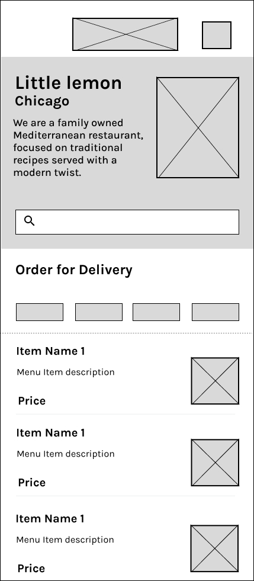

# 🍋 Little Lemon Food Ordering App — Final Project

This is the final project for the **Little Lemon** food ordering app, built using **React Native** with the **Expo** framework.

The app includes:
- Onboarding flow that collects user details and stores them using AsyncStorage.
- A scrollable Home screen with a search bar, category filters, and a food menu list.
- A Profile screen displaying stored user data and a logout button.
- Persistent navigation using React Navigation stack.

---

## 🧪 Tech Stack

- **React Native (Expo)**
- **Expo SDK version:** `~52.0.46`
- **React:** `18.3.1`
- **React Native:** `0.76.9`
- **Navigation:**
  - `@react-navigation/native`
  - `@react-navigation/native-stack`
- **Async Storage:** `@react-native-async-storage/async-storage`
- **Axios** for fetching menu items
- **expo-font** for custom fonts

---

## 📐 Wireframe

The Home screen was designed based on the wireframe shown below.  
You can find the image in the project under the following path:

📁 `assets/Wireframe_little_lemon_food_order_Final.jpg`



---

## Running the App

To run the app locally:

1. Install dependencies:

```bash
npm install
